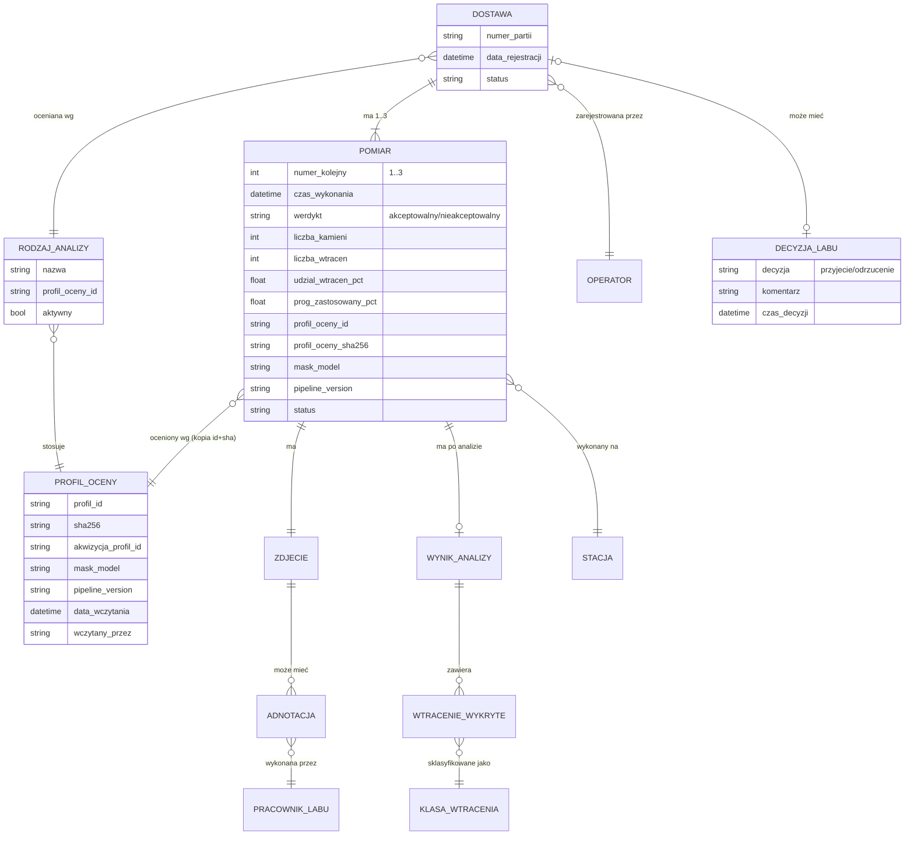
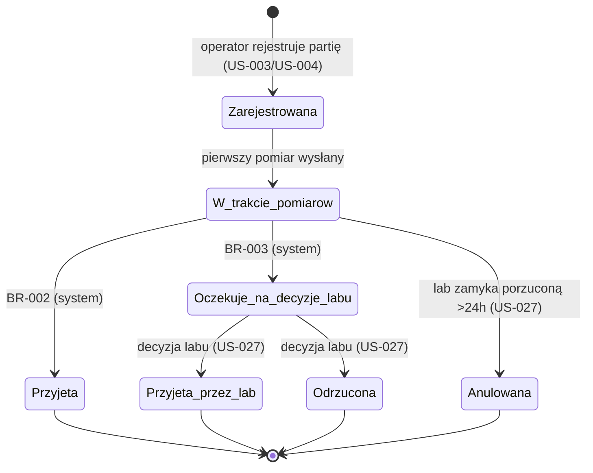

# Specyfikacja funkcjonalna: KamykAI — system kontroli jakości dostaw kruszywa

Wersja: 0.4 | Data: 2026-08-09 | Status: szkic
Zakres dokumentu: pełny system z oznaczonym MVP

## 1. Cel i kontekst

### 1.1 Cel biznesowy i miara sukcesu

Odbiorca kruszywa (producent chemii budowlanej) chce obiektywnie i szybko oceniać jakość dostarczanego surowca w momencie przyjęcia dostawy, zamiast polegać na ocenie wzrokowej magazyniera lub czasochłonnym badaniu laboratoryjnym każdej dostawy.

System KamykAI automatyzuje ocenę: magazynier nasypuje próbkę kamyków do kuwety w komorze pomiarowej, system fotografuje próbkę, analizuje obraz (segmentacja kamieni, klasyfikacja i zliczenie wtrąceń) i zwraca werdykt akceptowalna/nieakceptowalna na podstawie progu ilości wtrąceń.

Miary sukcesu:

- Czas od nasypania próbki do wyświetlenia werdyktu ≤ 30 s (bez oczekiwania na laboratorium).
- ≥ 90% dostaw rozstrzyganych na stanowisku pomiarowym bez angażowania laboratorium.
- 100% pomiarów (zdjęcie + wynik) zarchiwizowanych i dostępnych do wglądu w panelu laboratorium.

### 1.2 Zakres — co obejmuje ten dokument

Dokument specyfikuje trzy komponenty systemu KamykAI:

1. **Aplikację stacji pomiarowej** na Raspberry Pi z kamerą i ekranem dotykowym (interfejs operatora, wykonywanie zdjęć, komunikacja z serwisem analizującym, buforowanie offline).
2. **Serwis analizujący** na serwerze PC z GPU (REST API, analiza obrazu, ocena jakości, zapis wyników i archiwizacja zdjęć).
3. **Panel laboratorium** — aplikację przeglądarkową dla pracowników laboratorium (przegląd pomiarów, decyzje o spornych dostawach, adnotacja zdjęć) oraz administracji (konfiguracja progów i słowników).

### 1.3 Poza zakresem

- **Integracja z systemem ERP/WMS odbiorcy** (automatyczne pobieranie awizacji dostaw, księgowanie przyjęć) — partia identyfikowana jest kodem/numerem wpisywanym na stacji; integrację odłożono do czasu potwierdzenia systemu docelowego u klienta.
- **Trenowanie modeli ML i wyznaczanie progów** — przygotowanie modelu analizy obrazu oraz kalibracja progów są projektem odrębnym, opisanym w torze badawczym (§1.5); specyfikacja zakłada, że serwis analizujący dysponuje działającym modelem i wczytanym profilem oceny (§6.1). Adnotacje z panelu labu stanowią materiał wejściowy do przyszłego dotrenowania.
- **Sterowanie oświetleniem i mechaniką komory pomiarowej** — zakłada się stałe, niezmienne oświetlenie komory; ewentualne sterowanie (np. weryfikacja zapalenia lamp) odłożono do wyników pilotażu.
- **Portal dla dostawcy kruszywa** — dostawca nie ma dostępu do systemu; wyniki przekazywane są mu poza systemem (reklamacje, raporty) przez odbiorcę.
- **Aplikacja mobilna** — panel laboratorium jest aplikacją przeglądarkową desktop; wersja mobilna nie wnosi wartości w tym procesie.
- **Rozliczenia i reklamacje finansowe** — system dostarcza dowody (zdjęcia, wyniki), ale nie prowadzi procesu reklamacyjnego.

### 1.4 Założenia

- Z-01: Stanowisko pomiarowe jest jedno w MVP; architektura danych dopuszcza wiele stacji (identyfikator stacji przy każdym pomiarze).
- Z-02: Stacja i serwer analizujący pracują w tej samej sieci lokalnej zakładu; komunikacja wyłącznie po sieci LAN.
- Z-03: Kod kreskowy partii jest dostępny na dokumencie dostawy (etykieta dostawcy lub etykieta drukowana przy przyjęciu); numer partii to ogólny ciąg 10 znaków (BR-010).
- Z-04: Jedna próbka = jedna kuweta wypełniona zgodnie z instrukcją stanowiskową (poziom wypełnienia, rozprowadzenie); poprawność nasypania jest odpowiedzialnością operatora, a rażące odstępstwa wykrywa walidacja zdjęcia (US-021).
- Z-05: Rodzaje analiz (frakcje/asortymenty kruszywa) i progi wtrąceń definiuje laboratorium odbiorcy; wartości progowe nie są znane na etapie specyfikacji i są parametrem konfiguracyjnym.
- Z-06: Operator identyfikuje się przez wybór z listy (bez hasła) — stanowisko znajduje się w strefie dostępnej wyłącznie dla pracowników magazynu.
- Z-07: Decyzja systemu ma charakter wspomagający proces przyjęcia; formalna odpowiedzialność za przyjęcie towaru pozostaje po stronie ludzi (magazynier/laboratorium).
- Z-08: Progi oceny nie powstają w tym systemie — są wczytywane jako plik profilu oceny wyznaczony w torze badawczym (§1.5, §6.1). System ich nie wylicza i nie modyfikuje.
- Z-09: Próbka jest odmierzana kalibrowaną miarką, tak aby liczba kamieni w kadrze mieściła się w zakresie wymaganym przez profil oceny (BR-013). Dobór miarki jest zadaniem wdrożeniowym poza zakresem tej specyfikacji.

### 1.5 Relacja do toru badawczego

Progi, na których opiera się werdykt (BR-001), powstają w osobnym torze badawczym i trafiają tutaj jako **plik profilu oceny** (§6.1), wczytywany przez administratora w panelu.

| dokument | rola |
|---|---|
| `spec-przygotowanie-materialu.md` | przygotowanie i rozsypanie próbki na stanowisku badawczym |
| `spec-akwizycji.md` | zamrożenie i weryfikacja parametrów zdjęcia, zbieranie prób wg protokołu |
| `spec-analizy-barwy.md` | warstwa pomiarowa barwy — metryki na kamień i na próbkę |
| `spec-analizy-ksztaltu.md` | warstwa pomiarowa kształtu — jw. |
| **ten dokument** | warstwa decyzyjna: stosuje wyznaczone progi w ruchu produkcyjnym |

Zależność jest jednokierunkowa: tor badawczy produkuje profil oceny, system operacyjny go konsumuje i nigdy nie modyfikuje. Adnotacje z panelu (US-028) wracają do toru badawczego jako materiał wejściowy, ale nie zmieniają progów automatycznie.

**Warunek przenośności progów.** Profil oceny jest ważny wyłącznie dla warunków akwizycji, w których został wyznaczony. Plik niesie ich identyfikatory, a system weryfikuje zgodność przy wczytaniu (BR-014). Jeżeli komora pomiarowa stanowiska operacyjnego różni się od badawczego — innym oświetleniem, brakiem wzorca bieli w kadrze, innym sposobem nasypania — progi barwy nie są przenośne i wymagają rekalibracji na stanowisku docelowym. Jest to zagadnienie wdrożeniowe, otwarte na dzień wersji 0.4.

## 2. Słownik pojęć

| Pojęcie | Definicja |
|---|---|
| **Dostawa** | Pojedyncze zdarzenie dostarczenia partii kruszywa do zakładu, podlegające ocenie jakości. Obiekt nadrzędny dla pomiarów. |
| **Partia** | Identyfikator towaru nadany przez dostawcę lub odbiorcę (numer partii), wprowadzany na stacji skanerem lub z klawiatury. Jedna dostawa = jedna partia. |
| **Rodzaj analizy** | Konfigurowalna pozycja słownika (np. frakcja kruszywa) wiążąca asortyment z profilem oceny. |
| **Profil oceny** | Plik z progami i regułami klasyfikacji, wyznaczony w torze badawczym i wczytany do systemu (§6.1). Źródło wszystkich wartości progowych. |
| **Próbka** | Porcja kamyków odmierzona miarką i nasypana do kuwety, poddawana jednemu pomiarowi. |
| **Pomiar** | Pojedynczy cykl: zdjęcie próbki → analiza → wynik. Dostawa ma 1–3 pomiary. |
| **Wtrącenie** | Kamień zaklasyfikowany jako niezgodny — obcy materiał albo kamień, którego zmierzone cechy (barwa, kształt, wielkość) wypadają poza zakres zdefiniowany w profilu oceny. Zbiór klas wtrąceń jest wspólny z listą przyczyn odrzucenia używaną w torze badawczym (§6.1). |
| **Udział wtrąceń** | Liczba wtrąceń podzielona przez liczbę wszystkich rozpoznanych kamieni w próbce, w procentach. Wielkość, do której odnoszą się progi (BR-001). |
| **Werdykt pomiaru** | Wynik pojedynczego pomiaru: *akceptowalny* albo *nieakceptowalny*, wyznaczony przez porównanie udziału wtrąceń z progiem z profilu oceny. |
| **Wynik dostawy** | Rozstrzygnięcie dla całej dostawy: *przyjęta* (automatycznie lub decyzją labu) albo *odrzucona* (decyzją labu). |
| **Procedura próbek kontrolnych** | Sekwencja maks. 3 pomiarów uruchamiana, gdy pierwszy pomiar jest nieakceptowalny (reguła 2 z 3 — BR-002/BR-003). |
| **Stacja pomiarowa** | Zestaw: komora pomiarowa, kamera, Raspberry Pi, ekran dotykowy, czytnik kodów kreskowych. |
| **Serwis analizujący** | Usługa na serwerze PC z GPU wykonująca analizę obrazu i przechowująca dane, wywoływana przez REST API. |
| **Panel laboratorium** | Aplikacja przeglądarkowa do przeglądu pomiarów, podejmowania decyzji o spornych dostawach, adnotacji zdjęć i administracji. |
| **Adnotacja** | Oznaczenie wykonane przez pracownika laboratorium na zdjęciu/pomiarze (np. korekta klasyfikacji wtrącenia), gromadzone jako materiał do dotrenowania modelu. |
| **Bufor lokalny** | Kolejka zdjęć i metadanych na stacji pomiarowej oczekujących na wysyłkę do serwisu analizującego przy braku łączności. |

## 3. Aktorzy

| Aktor | Opis i cel | Typ |
|---|---|---|
| **Magazynier (operator)** | Przyjmuje dostawy; na stacji rejestruje partię, wykonuje pomiary, odczytuje werdykt i na jego podstawie przyjmuje towar lub wstrzymuje rozładunek. | człowiek |
| **Pracownik laboratorium** | Przegląda pomiary i zdjęcia, podejmuje decyzję przyjęcia/odrzucenia dla dostaw skierowanych do laboratorium, adnotuje zdjęcia. | człowiek |
| **Administrator** | Konfiguruje rodzaje analiz i progi, zarządza listą operatorów, stacjami i klasami wtrąceń; rola techniczno-jakościowa (może być pełniona przez kierownika laboratorium). | człowiek |
| **Stacja pomiarowa (aplikacja RPi)** | Wykonuje zdjęcia, wysyła je do serwisu analizującego, prezentuje wyniki operatorowi, buforuje dane offline. | system |
| **Serwis analizujący** | Analizuje obrazy, wyznacza werdykty, przechowuje pomiary, zdjęcia i decyzje; udostępnia API stacji i panelowi. | system |

## 4. Model domeny

Dostawa jest bytem nadrzędnym: powstaje przy rejestracji partii na stacji i gromadzi 1–3 pomiary. Każdy pomiar ma dokładnie jedno zdjęcie i (po analizie) jeden wynik analizy z listą wykrytych wtrąceń. Dostawa skierowana do laboratorium otrzymuje dokładnie jedną decyzję laboratorium. Rodzaj analizy wskazuje obowiązujący profil oceny — pomiar zapamiętuje identyfikator i sumę kontrolną profilu oraz wersje modelu i pipeline'u analizy, aby werdykt dało się odtworzyć po każdej późniejszej zmianie konfiguracji lub modelu (BR-005).



Kluczowe atrybuty pomiaru: numer kolejny w ramach dostawy (1–3), znacznik czasu, identyfikator stacji, werdykt, **liczba rozpoznanych kamieni**, liczba wtrąceń ogółem i per klasa, **udział wtrąceń w procentach**, zastosowany próg procentowy, **identyfikator i suma kontrolna profilu oceny**, **wersja modelu masek i wersja pipeline'u analizy**, status przetwarzania (oczekuje w buforze / wysłany / przeanalizowany / błąd).

Trzy ostatnie pozycje są warunkiem audytowalności. Zapisanie samego progu nie wystarcza: zmiana modelu masek przesuwa mierzone wielkości o wielokrotność rozrzutu populacji, więc bez wersji modelu i pipeline'u historyczny werdykt nie jest odtwarzalny, a próg zmienia znaczenie po każdej aktualizacji modelu (NFR-006).

## 5. Wymagania funkcjonalne

### 5.1 Moduł: Rejestracja dostawy (stacja pomiarowa)

Cel: operator w kilkanaście sekund identyfikuje siebie, partię i rodzaj analizy, tak aby każdy pomiar był jednoznacznie przypisany.

**US-001 [Must]** Jako magazynier chcę wybrać siebie z listy operatorów na ekranie dotykowym, aby każdy pomiar miał przypisaną osobę wykonującą bez konieczności logowania hasłem.

Kryteria akceptacji:

- Kiedy aplikacja stacji jest uruchomiona i żaden operator nie jest wybrany, wtedy przed rejestracją partii wyświetlana jest lista aktywnych operatorów (imię i nazwisko), a rozpoczęcie rejestracji bez wyboru operatora jest zablokowane.
- Kiedy operator zostaje wybrany, wtedy jego nazwisko jest widoczne na pasku statusu wszystkich ekranów i zapisywane przy każdej zarejestrowanej dostawie.
- Kiedy stacja pozostaje bezczynna przez 15 minut, wtedy wybór operatora jest kasowany i wymagany ponownie (ochrona przed przypisywaniem pomiarów nieobecnemu operatorowi).

**US-002 [Should]** Jako magazynier chcę zeskanować kod kreskowy partii czytnikiem, aby uniknąć błędów ręcznego przepisywania numeru.

Kryteria akceptacji:

- Zakładając, że ekran rejestracji partii jest aktywny, kiedy operator skanuje kod czytnikiem, wtedy numer partii pojawia się w polu w ciągu 1 s, a fokus przechodzi do wyboru rodzaju analizy.
- Kiedy zeskanowany kod nie przechodzi walidacji formatu (BR-010), wtedy stacja wyświetla komunikat o błędnym kodzie i pozostawia pole puste.
- Kiedy czytnik jest odłączony lub nie działa, wtedy rejestracja pozostaje możliwa z klawiatury ekranowej (US-003) bez dodatkowych kroków.

**US-003 [Must]** Jako magazynier chcę wpisać numer partii na klawiaturze ekranowej, aby zarejestrować dostawę także wtedy, gdy kod kreskowy jest nieczytelny lub go brak.

Kryteria akceptacji:

- Kiedy operator dotyka pola numeru partii, wtedy wyświetla się klawiatura ekranowa (znaki alfanumeryczne) o przyciskach rozmiaru min. 12×12 mm.
- Kiedy wpisany numer nie przechodzi walidacji formatu (BR-010) albo pole jest puste, wtedy przejście dalej jest zablokowane, a błędne pole wskazane komunikatem.
- Kiedy dla wpisanego numeru partii istnieje już dostawa otwarta tego samego dnia, wtedy stacja proponuje wznowienie tej dostawy (US-005) zamiast utworzenia nowej.

**US-004 [Must]** Jako magazynier chcę wybrać rodzaj analizy z listy, aby system zastosował właściwy próg wtrąceń dla danego asortymentu.

Kryteria akceptacji:

- Kiedy ekran rejestracji jest aktywny, wtedy lista zawiera wyłącznie aktywne rodzaje analiz pobrane z serwisu analizującego (przy braku łączności — ostatnią zbuforowaną kopię listy z widoczną datą jej pobrania).
- Kiedy operator nie wybrał rodzaju analizy, wtedy przejście do ekranu pomiaru jest zablokowane.
- Lista mieści się na jednym ekranie do 8 pozycji; powyżej 8 pozycji jest przewijana dotykiem.

**US-005 [Should]** Jako magazynier chcę wrócić do przerwanej dostawy (np. po restarcie stacji w trakcie procedury kontrolnej), aby nie tracić wykonanych już pomiarów.

Kryteria akceptacji:

- Kiedy aplikacja stacji uruchamia się, a w systemie istnieje dostawa w stanie „W trakcie pomiarów" zarejestrowana na tej stacji, wtedy stacja proponuje jej wznowienie z zachowaniem liczby i wyników dotychczasowych pomiarów.
- Kiedy operator odrzuca wznowienie, wtedy dostawa pozostaje otwarta i widoczna w panelu laboratorium jako niedokończona (do ręcznego zamknięcia przez lab — US-027).

### 5.2 Moduł: Pomiar i werdykt (stacja pomiarowa)

Cel: operator jednym przyciskiem uruchamia pomiar i otrzymuje jednoznaczny werdykt oraz instrukcję następnego kroku.

**US-006 [Must]** Jako magazynier chcę wyzwolić pomiar jednym dużym przyciskiem na ekranie dotykowym, aby wykonać analizę próbki bez obsługi komputera.

Scenariusz główny:

1. Operator nasypuje próbkę do kuwety i umieszcza ją w komorze pomiarowej.
2. Operator dotyka przycisku „WYKONAJ POMIAR" (przycisk zajmuje min. 25% powierzchni ekranu pomiaru).
3. Stacja wykonuje zdjęcie próbki kamerą.
4. Stacja wysyła zdjęcie z metadanymi (dostawa, numer pomiaru, operator, stacja, czas) do serwisu analizującego.
5. Stacja wyświetla stan „Analiza w toku…" z animowanym wskaźnikiem postępu.
6. Serwis zwraca wynik; stacja wyświetla werdykt (US-007).

Rozszerzenia:

- 3a. Zdjęcie nie może zostać wykonane (błąd kamery): stacja wyświetla komunikat „Błąd kamery — powiadom serwis", loguje zdarzenie i pozwala ponowić próbę; pomiar nie jest zaliczany.
- 4a. Brak łączności z serwisem: zdjęcie trafia do bufora lokalnego (US-013), a stacja informuje operatora, że wynik będzie dostępny po przywróceniu łączności.
- 6a. Serwis zwraca błąd „pomiar nieważny" (walidacja zdjęcia — US-021): stacja wyświetla przyczynę (np. „kuweta pusta", „zdjęcie nieostre") i instrukcję poprawy; pomiar nie liczy się do procedury kontrolnej.
- 6b. Serwis nie odpowiada w ciągu 30 s: stacja przerywa oczekiwanie, przenosi zadanie do bufora i postępuje jak w 4a.

Kryteria akceptacji:

- Kiedy przycisk pomiaru zostanie dotknięty, wtedy jest blokowany do zakończenia cyklu (brak możliwości podwójnego wyzwolenia).
- Kiedy pomiar jest niemożliwy (brak wybranej dostawy), wtedy przycisk jest nieaktywny z widoczną przyczyną.

**US-007 [Must]** Jako magazynier chcę zobaczyć werdykt pomiaru w formie jednoznacznej i widocznej z odległości 2 m, aby natychmiast wiedzieć, co robić dalej.

Kryteria akceptacji:

- Kiedy werdykt to „akceptowalny", wtedy ekran wyświetla zielone tło, napis „PRÓBKA OK" oraz udział wtrąceń wraz z progiem i liczbami źródłowymi (np. „1,2 % / limit 2,0 % — 12 wtrąceń z 987 kamieni").
- Kiedy werdykt to „nieakceptowalny", wtedy ekran wyświetla czerwone tło, napis „PRÓBKA POZA NORMĄ", udział wtrąceń z progiem i liczbami źródłowymi, rozbicie na klasy wtrąceń oraz instrukcję następnego kroku wynikającą z procedury kontrolnej (US-008).
- Napisy werdyktu mają wysokość min. 15 mm (czytelność z 2 m).

**US-008 [Must]** Jako magazynier chcę być prowadzony krok po kroku przez procedurę próbek kontrolnych, aby poprawnie wykonać ocenę 2 z 3 bez znajomości regulaminu.

Scenariusz główny (pomiar 1 nieakceptowalny):

1. Stacja wyświetla: „Wynik poza normą. Wymagane 2 próbki kontrolne. Nasyp nową próbkę (2 z 3) i wykonaj pomiar."
2. Operator wykonuje pomiar 2. Jeśli akceptowalny — stacja prosi o próbkę 3. Jeśli nieakceptowalny — dostawa od razu kierowana do laboratorium (BR-003), bez pomiaru 3.
3. Operator wykonuje pomiar 3 (jeśli wymagany). Jeśli akceptowalny — dostawa przyjęta (2 z 3). Jeśli nieakceptowalny — dostawa kierowana do laboratorium.

Kryteria akceptacji:

- Kiedy trwa procedura kontrolna, wtedy ekran pokazuje licznik pomiarów (np. „Pomiar 2 z 3") i werdykty dotychczasowych pomiarów.
- Kiedy drugi pomiar jest nieakceptowalny, wtedy stacja nie pozwala wykonać trzeciego pomiaru w tej dostawie i przechodzi do ekranu skierowania do laboratorium (US-010).
- Kiedy dostawa osiągnęła rozstrzygnięcie, wtedy wykonanie kolejnych pomiarów w jej ramach jest zablokowane (BR-004).

**US-009 [Must]** Jako magazynier chcę, aby po akceptowalnym wyniku system zamknął dostawę i wyświetlił potwierdzenie przyjęcia, aby mieć jednoznaczną podstawę do rozładunku.

Kryteria akceptacji:

- Kiedy pomiar 1 jest akceptowalny albo spełniona jest reguła 2 z 3 (BR-002), wtedy dostawa przechodzi w stan „Przyjęta", a ekran wyświetla podsumowanie: numer partii, rodzaj analizy, werdykty pomiarów, czas, napis „TOWAR PRZYJĘTY".
- Kiedy operator dotyka „Zakończ", wtedy stacja wraca do ekranu rejestracji nowej dostawy.

**US-010 [Must]** Jako magazynier chcę otrzymać wyraźną informację, że dostawa czeka na decyzję laboratorium, aby wstrzymać rozładunek i nie podejmować decyzji samodzielnie.

Kryteria akceptacji:

- Kiedy 2 pomiary w dostawie są nieakceptowalne, wtedy dostawa przechodzi w stan „Oczekuje na decyzję labu", a ekran wyświetla: pomarańczowe tło, napis „WSTRZYMAJ PRZYJĘCIE — DECYZJA LABORATORIUM", numer partii i werdykty pomiarów.
- Kiedy dostawa jest w tym stanie, wtedy stacja pozwala rozpocząć rejestrację kolejnej dostawy (oczekiwanie nie blokuje stanowiska).

**US-011 [Should]** Jako magazynier chcę zobaczyć na stacji decyzję laboratorium dla wstrzymanej dostawy, aby wiedzieć, czy rozładować czy zwrócić towar, bez telefonowania do labu.

Kryteria akceptacji:

- Kiedy laboratorium podejmie decyzję, wtedy stacja w ciągu 60 s wyświetla powiadomienie z numerem partii i decyzją (przyjęcie/odrzucenie); powiadomienie pozostaje widoczne do potwierdzenia dotknięciem.
- Kiedy operator otwiera listę „Oczekujące dostawy", wtedy widzi wszystkie dostawy z ostatnich 48 h w stanie oczekiwania lub rozstrzygnięte decyzją labu, z aktualnym statusem.

**US-012 [Could]** Jako magazynier chcę obejrzeć na stacji zdjęcie próbki z zaznaczonymi wtrąceniami, aby zrozumieć, dlaczego próbka jest poza normą.

Kryteria akceptacji:

- Kiedy wynik pomiaru jest wyświetlony, wtedy dotknięcie miniatury otwiera zdjęcie z nałożonymi ramkami/maskami wtrąceń wraz z klasą każdego wtrącenia.

### 5.3 Moduł: Praca offline i buforowanie (stacja pomiarowa)

Cel: przerwa w łączności z serwerem nie zatrzymuje przyjęć i nie gubi żadnego zdjęcia.

**US-013 [Must]** Jako magazynier chcę, aby przy braku łączności zdjęcia były buforowane i automatycznie dosyłane, aby żaden pomiar nie przepadł.

Kryteria akceptacji:

- Zakładając brak odpowiedzi serwisu, kiedy operator wyzwala pomiar, wtedy zdjęcie z metadanymi zapisuje się w buforze lokalnym, a stacja wyświetla „Wynik po przywróceniu łączności" i pozycję w kolejce.
- Kiedy łączność wraca, wtedy stacja wysyła zbuforowane pomiary w kolejności wykonania (FIFO) bez udziału operatora, a wyniki dosyłane są jako powiadomienia (jak w US-011).
- Kiedy bufor osiąga limit pojemności (BR-008), wtedy stacja blokuje wykonywanie nowych pomiarów i wyświetla komunikat „Bufor pełny — powiadom serwis"; żadne zbuforowane zdjęcie nie jest nadpisywane.
- Kiedy pomiar dostawy w toku oczekuje w buforze, wtedy dostawa pozostaje w stanie „W trakcie pomiarów", a stacja nie ogłasza werdyktu do czasu otrzymania wyniku.

**US-014 [Should]** Jako magazynier chcę stale widzieć stan łączności i bufora na pasku statusu, aby wiedzieć, czy wyniki będą natychmiastowe.

Kryteria akceptacji:

- Pasek statusu na każdym ekranie pokazuje: stan łączności z serwisem (online/offline, odświeżany co ≤10 s), liczbę pomiarów w buforze, wybranego operatora, godzinę.
- Kiedy stacja przechodzi w tryb offline, wtedy wskaźnik zmienia kolor i stan w ciągu 10 s od utraty łączności.

### 5.4 Moduł: Interfejs stacji pomiarowej — opis funkcjonalny ekranów

Cel: kompletny, zamknięty katalog ekranów aplikacji RPi; aplikacja nie zawiera innych ekranów ani nawigacji poza opisaną.

Zasady wspólne: aplikacja działa w trybie pełnoekranowym (kiosk) bez dostępu do systemu operacyjnego; wszystkie elementy dotykowe mają min. 12×12 mm (obsługa palcami, bez rękawic); pasek statusu (US-014) widoczny na każdym ekranie; język interfejsu: polski.

| Ekran | Zawartość i funkcje | Przejścia |
|---|---|---|
| **E-01 Wybór operatora** | Lista aktywnych operatorów (przyciski z nazwiskami). | Po wyborze → E-02. |
| **E-02 Rejestracja partii** | Pole numeru partii (skaner/klawiatura ekranowa), lista rodzajów analiz, przycisk „Dalej" (aktywny po wypełnieniu obu pól), przycisk „Oczekujące dostawy" → E-06, przycisk zmiany operatora → E-01. | „Dalej" → E-03. |
| **E-03 Pomiar** | Podgląd na żywo z kamery (kontrola ułożenia próbki), duży przycisk „WYKONAJ POMIAR", licznik pomiarów w dostawie („Pomiar n z 3"), werdykty dotychczasowych pomiarów, przycisk „Przerwij dostawę" (z potwierdzeniem). | Po pomiarze → E-04. |
| **E-04 Wynik pomiaru** | Werdykt pełnoekranowy (zielony/czerwony wg US-007), liczba wtrąceń i próg, miniatura zdjęcia (→ podgląd z wtrąceniami, US-012), przycisk kontynuacji zależny od stanu: „Zakończ — towar przyjęty" / „Następna próbka kontrolna" / „Skierowano do labu". | → E-05 (rozstrzygnięcie) albo → E-03 (kolejna próbka). |
| **E-05 Podsumowanie dostawy** | Status końcowy („TOWAR PRZYJĘTY" / „WSTRZYMAJ PRZYJĘCIE — DECYZJA LABORATORIUM" / decyzja labu), numer partii, werdykty wszystkich pomiarów, przycisk „Zakończ". | „Zakończ" → E-02. |
| **E-06 Oczekujące dostawy** | Lista dostaw z 48 h w stanach „Oczekuje na decyzję labu" i rozstrzygniętych przez lab: partia, czas, status, decyzja. | Powrót → E-02. |
| **E-07 Diagnostyka** | Wynik autotestu (kamera, skaner, łączność z serwisem, zapełnienie bufora), wersja aplikacji, identyfikator stacji, przycisk „Zdjęcie testowe" (US-016). Dostęp: przytrzymanie logo na pasku statusu 5 s. | Powrót → poprzedni ekran. |

Powiadomienie o decyzji labu (US-011) wyświetla się jako nakładka na dowolnym ekranie i wymaga potwierdzenia dotknięciem.

### 5.5 Moduł: Diagnostyka stanowiska (stacja pomiarowa)

Cel: operator lub serwisant potrafi w minutę stwierdzić, czy stanowisko jest sprawne.

**US-015 [Should]** Jako magazynier chcę, aby stacja po uruchomieniu wykonała autotest, aby wykryć usterkę przed pierwszą dostawą.

Kryteria akceptacji:

- Kiedy aplikacja startuje, wtedy sprawdza kolejno: dostępność kamery (wykonanie zdjęcia testowego bez zapisu), obecność czytnika kodów, łączność z serwisem analizującym, wolne miejsce w buforze; wynik każdego testu (OK/błąd) jest widoczny na E-07.
- Kiedy autotest wykryje niesprawną kamerę, wtedy stacja blokuje wykonywanie pomiarów do czasu pomyślnego ponowienia testu; pozostałe usterki (skaner, łączność) nie blokują pracy.

**US-016 [Should]** Jako serwisant/administrator chcę wykonać zdjęcie testowe i obejrzeć je na ekranie, aby ocenić czystość obiektywu i ustawienie kamery po czyszczeniu komory.

Kryteria akceptacji:

- Kiedy na E-07 zostanie dotknięty przycisk „Zdjęcie testowe", wtedy stacja wykonuje i wyświetla zdjęcie w pełnej rozdzielczości z możliwością powiększenia; zdjęcie testowe nie jest wysyłane do analizy ani zapisywane jako pomiar.

### 5.6 Moduł: Serwis analizujący (serwer PC z GPU)

Cel: przyjąć zdjęcie przez REST API, wyznaczyć werdykt pomiaru i status dostawy, trwale zapisać dane.

**US-017 [Must]** System udostępnia REST API przyjmujące pomiar (zdjęcie + metadane) i zwracające wynik analizy, aby stacje pomiarowe mogły działać bez lokalnej logiki oceny.

Kryteria akceptacji:

- Kiedy stacja wysyła żądanie pomiaru zawierające: zdjęcie, identyfikator dostawy (lub dane do jej utworzenia: numer partii, rodzaj analizy, operator), numer pomiaru, identyfikator stacji i znacznik czasu wykonania zdjęcia, wtedy serwis zwraca wynik analizy w jednej odpowiedzi synchronicznej: werdykt, liczbę wtrąceń ogółem i per klasa, zastosowany próg, status dostawy po tym pomiarze oraz instrukcję następnego kroku (przyjmij / próbka kontrolna / czekaj na lab).
- Kiedy żądanie jest niekompletne lub zdjęcie nieczytelne jako plik, wtedy serwis zwraca błąd walidacji z kodem i opisem przyczyny; żądanie nie tworzy pomiaru.
- Kiedy stacja ponawia to samo żądanie (ten sam identyfikator pomiaru nadany przez stację), wtedy serwis zwraca zapisany wcześniej wynik zamiast tworzyć duplikat (idempotentność — warunek konieczny dla bufora i retry).
- API udostępnia ponadto: pobranie listy aktywnych rodzajów analiz i operatorów (dla US-001/US-004), pobranie statusów dostaw stacji z ostatnich 48 h (dla E-06 i US-011).

**US-018 [Must]** System analizuje zdjęcie próbki (segmentacja kamieni, klasyfikacja wtrąceń, zliczenie) i wyznacza werdykt pomiaru na podstawie progu, aby ocena była powtarzalna i niezależna od człowieka.

Kryteria akceptacji:

- Kiedy serwis przyjmuje poprawne zdjęcie, wtedy wykonuje kolejno: segmentację (maski pojedynczych kamieni), **zliczenie wszystkich rozpoznanych kamieni**, klasyfikację wtrąceń wg klas i reguł z profilu oceny, obliczenie **udziału wtrąceń** i porównanie z progiem procentowym, wyznaczenie werdyktu (BR-001).
- Kiedy liczba rozpoznanych kamieni jest poniżej minimum z profilu oceny, wtedy pomiar otrzymuje status „pomiar nieważny" z przyczyną „za mało kamieni" i nie otrzymuje werdyktu (BR-013).
- Wynik analizy zawiera dla każdego wykrytego wtrącenia: klasę, pewność klasyfikacji i współrzędne (maska lub ramka) — dane wystarczające do wizualizacji nałożonej na zdjęcie (US-012, US-025).
- Wynik analizy zawiera ponadto liczbę rozpoznanych kamieni, udział wtrąceń ogółem i per klasa oraz identyfikator i sumę kontrolną zastosowanego profilu oceny.
- Kiedy analiza kończy się błędem przetwarzania (awaria modelu, brak zasobów), wtedy serwis zwraca stacji błąd techniczny, pomiar otrzymuje status „błąd" i jest widoczny w panelu laboratorium; pomiar nie liczy się do procedury kontrolnej.
- Czas analizy jednego zdjęcia nie przekracza 10 s (NFR-001).

**US-019 [Must]** System trwale zapisuje każdy pomiar (zdjęcie, wynik, metadane) w bazie danych i archiwum zdjęć na serwerze, aby laboratorium miało pełną historię, a na stacji zdjęcia były tylko buforowane.

Kryteria akceptacji:

- Kiedy analiza się kończy (werdyktem lub błędem), wtedy zapisane są: zdjęcie oryginalne, wynik analizy (wtrącenia, werdykt, udział, próg), metadane (dostawa, operator, stacja, czasy, profil oceny, wersje modelu i pipeline'u) oraz metadane akwizycji zwrócone przez kamerę — przed zwróceniem odpowiedzi stacji.
- Zdjęcie zapisywane jest **wyłącznie w formacie PNG** (bezstratnie, w pełnej rozdzielczości), opcjonalnie z towarzyszącym plikiem RAW. Kompresja stratna jest niedopuszczalna: przesuwa składowe a\* i b\*, a podpróbkowanie chrominancji miesza barwę sąsiadujących kamieni — czyli zmienia dokładnie te wielkości, na których oparte są progi. Ten sam format obowiązuje na stanowisku badawczym, żeby progi wyznaczone tam obowiązywały tutaj.
- Kiedy stacja otrzyma potwierdzenie zapisu, wtedy może usunąć zdjęcie ze swojego bufora; stacja nie przechowuje zdjęć potwierdzonych dłużej niż 24 h (BR-009).
- Zdjęcia i wyniki są przechowywane na serwerze przez min. 24 miesiące (NFR-007).

**US-020 [Must]** System wyznacza status dostawy po każdym pomiarze według reguły 2 z 3, aby logika procedury kontrolnej była w jednym miejscu, wspólna dla stacji i panelu.

Kryteria akceptacji:

- Kiedy pomiar 1 jest akceptowalny, wtedy dostawa przechodzi w stan „Przyjęta".
- Kiedy w dostawie zapadną 2 werdykty akceptowalne, wtedy dostawa przechodzi w stan „Przyjęta" (BR-002).
- Kiedy w dostawie zapadną 2 werdykty nieakceptowalne, wtedy dostawa przechodzi w stan „Oczekuje na decyzję labu" i pojawia się w kolejce decyzji panelu (BR-003).
- Kiedy dostawa jest rozstrzygnięta, wtedy próba dopisania kolejnego pomiaru jest odrzucana błędem (BR-004).

**US-021 [Should]** System waliduje jakość zdjęcia przed analizą (pusta kuweta, nieostrość, prześwietlenie), aby nie wydawać werdyktów na podstawie bezwartościowych zdjęć.

Kryteria akceptacji:

- Kiedy zdjęcie nie spełnia progów walidacji (progi konfigurowalne per stacja), wtedy serwis zwraca wynik „pomiar nieważny" z kodem przyczyny (pusta kuweta / nieostre / prześwietlone), pomiar nie otrzymuje werdyktu i nie liczy się do procedury kontrolnej, a zdjęcie jest zapisywane do wglądu w panelu.
- Do czasu wdrożenia walidacji (MVP bez US-021) wszystkie technicznie poprawne zdjęcia trafiają do analizy.

**US-022 [Should]** System powiadamia laboratorium o dostawie oczekującej na decyzję, aby skrócić czas przestoju samochodu z towarem.

Kryteria akceptacji:

- Kiedy dostawa przechodzi w stan „Oczekuje na decyzję labu", wtedy w ciągu 60 s wysyłane jest powiadomienie e-mail na skonfigurowany adres (lista adresów w konfiguracji) z numerem partii, czasem i odnośnikiem do dostawy w panelu.
- Kiedy wysyłka e-mail się nie powiedzie, wtedy zdarzenie jest logowane, a dostawa i tak jest widoczna w kolejce decyzji panelu (powiadomienie jest kanałem pomocniczym).

### 5.7 Moduł: Panel laboratorium

Cel: laboratorium widzi wszystkie pomiary, rozstrzyga dostawy sporne i gromadzi adnotacje do doskonalenia modelu.

**US-023 [Must]** Jako pracownik laboratorium chcę logować się do panelu loginem i hasłem, aby dostęp do danych i decyzji mieli wyłącznie uprawnieni pracownicy.

Kryteria akceptacji:

- Kiedy użytkownik podaje poprawny login i hasło, wtedy uzyskuje dostęp zgodny ze swoją rolą (lab / administrator — sekcja 7.1).
- Kiedy użytkownik podaje błędne dane 5 razy z rzędu, wtedy konto jest blokowane na 15 minut, a zdarzenie logowane.
- Kiedy sesja jest bezczynna 30 minut, wtedy wymagane jest ponowne zalogowanie.

**US-024 [Must]** Jako pracownik laboratorium chcę przeglądać listę wszystkich dostaw i pomiarów z filtrowaniem, aby szybko odnaleźć konkretną partię lub okres.

Kryteria akceptacji:

- Lista dostaw pokazuje: numer partii, rodzaj analizy, datę, stację, liczbę pomiarów, status, decyzję labu (jeśli jest); sortowanie domyślne od najnowszych.
- Kiedy użytkownik filtruje po dowolnej kombinacji: zakres dat, numer partii (fragment), rodzaj analizy, status, stacja, wtedy lista zawęża się do pasujących rekordów w czasie <2 s przy 50 000 dostaw w bazie (NFR-002).
- Kiedy brak wyników dla filtra, wtedy panel wyświetla jednoznaczny komunikat „Brak dostaw spełniających kryteria".

**US-025 [Must]** Jako pracownik laboratorium chcę obejrzeć szczegóły dostawy: wszystkie pomiary, zdjęcia w pełnej rozdzielczości i wykryte wtrącenia, aby ocenić zasadność werdyktów systemu.

Kryteria akceptacji:

- Widok dostawy pokazuje: metadane dostawy, oś czasu pomiarów, dla każdego pomiaru werdykt, liczbę wtrąceń per klasa, zastosowany próg i zdjęcie.
- Kiedy użytkownik otwiera zdjęcie, wtedy może powiększać je do 100% rozdzielczości i włączać/wyłączać warstwę wizualizacji wtrąceń (ramki/maski z klasą i pewnością).
- Kiedy pomiar ma status „błąd" lub „pomiar nieważny", wtedy widoczna jest przyczyna techniczna.

**US-026 [Must]** Jako pracownik laboratorium chcę widzieć osobną kolejkę dostaw oczekujących na decyzję, aby żadna wstrzymana dostawa nie umknęła.

Kryteria akceptacji:

- Kolejka pokazuje wyłącznie dostawy w stanie „Oczekuje na decyzję labu", posortowane od najstarszej, z czasem oczekiwania.
- Licznik dostaw oczekujących jest widoczny z każdego miejsca panelu (nagłówek).

**US-027 [Must]** Jako pracownik laboratorium chcę dla dostawy oczekującej zarejestrować decyzję „przyjęcie" albo „odrzucenie" z komentarzem, aby formalnie rozstrzygnąć dostawę i poinformować magazyn.

Kryteria akceptacji:

- Kiedy użytkownik wybiera decyzję, wtedy komentarz jest obowiązkowy przy odrzuceniu, a opcjonalny przy przyjęciu; decyzja zapisuje się z nazwiskiem decydenta i czasem.
- Kiedy decyzja zostaje zapisana, wtedy dostawa przechodzi w stan końcowy („Przyjęta przez lab" / „Odrzucona"), znika z kolejki decyzji, a stacja otrzymuje informację (US-011).
- Kiedy dostawa ma status „W trakcie pomiarów" starszy niż 24 h (dostawa porzucona), wtedy pracownik laboratorium może zamknąć ją ręcznie ze statusem „Anulowana" i komentarzem.
- Zapisanej decyzji nie można zmienić ani usunąć (BR-007); pomyłkę dokumentuje się komentarzem uzupełniającym.

**US-028 [Should]** Jako pracownik laboratorium chcę adnotować zdjęcia (oznaczyć błędnie sklasyfikowane lub pominięte wtrącenia), aby gromadzić materiał do dotrenowania modelu.

Kryteria akceptacji:

- Kiedy użytkownik przegląda zdjęcie, wtedy może: oznaczyć wykryte wtrącenie jako „błędna klasa" (ze wskazaniem poprawnej) lub „fałszywa detekcja", oraz dorysować ramkę dla wtrącenia pominiętego (ze wskazaniem klasy).
- Adnotacje zapisują się z autorem i czasem, nie zmieniają werdyktu pomiaru ani statusu dostawy (BR-006).
- Adnotacje są eksportowalne w formacie npz o udokumentowanym schemacie (klucze, wymiary i typy tablic, mapowanie identyfikatorów klas — dokumentacja schematu jest częścią dostawy); eksport do COCO JSON jako rozszerzenie [Could] na wypadek użycia zewnętrznych narzędzi ML.

**US-029 [Should]** Jako pracownik laboratorium chcę wyeksportować wyniki pomiarów za wybrany okres do pliku CSV, aby raportować jakość dostawcy i wspierać reklamacje.

Kryteria akceptacji:

- Kiedy użytkownik wybiera zakres dat i opcjonalne filtry (jak w US-024) i uruchamia eksport, wtedy otrzymuje plik CSV (kodowanie UTF-8, separator średnik) z wierszem na pomiar: dostawa, partia, rodzaj analizy, czas, stacja, operator, werdykt, liczba kamieni, liczba wtrąceń ogółem i per klasa, udział wtrąceń ogółem i per klasa, zastosowany próg, identyfikator profilu oceny, wersja modelu masek, wersja pipeline'u, status dostawy, decyzja labu.
- Eksport do 100 000 wierszy generuje się w <30 s; większy zakres jest odrzucany z komunikatem o zawężeniu filtra.

### 5.8 Moduł: Administracja i konfiguracja (panel)

Cel: parametry oceny i słowniki utrzymuje administrator bez udziału programistów.

**US-030 [Must]** Jako administrator chcę wczytać plik profilu oceny i przypisać go do rodzaju analizy, aby zmieniać kryteria oceny bez zmian w oprogramowaniu i bez przepisywania wartości ręcznie.

Kryteria akceptacji:

- Kiedy administrator wczytuje plik profilu oceny (§6.1), wtedy panel pokazuje jego zawartość do zatwierdzenia: identyfikator, progi, reguły klasyfikacji, warunki ważności i sumę kontrolną; zapis następuje dopiero po zatwierdzeniu.
- Kiedy plik nie przechodzi walidacji schematu albo jego warunki ważności nie zgadzają się z konfiguracją stanowiska, wtedy wczytanie jest odrzucane z podaniem konkretnej rozbieżności (BR-014).
- Kiedy profil zostaje przypisany do rodzaju analizy, wtedy obowiązuje wyłącznie pomiary wykonane po zapisaniu zmiany; pomiary historyczne zachowują identyfikator i sumę kontrolną profilu z chwili analizy (BR-005).
- Kiedy administrator chce zmienić pojedynczą wartość progową, wtedy edytuje plik poza systemem i wczytuje go jako nowy profil — **edycja progów w formularzu panelu nie jest przewidziana**, żeby wartość obowiązująca w systemie zawsze odpowiadała plikowi o znanej sumie kontrolnej.
- Każde wczytanie profilu jest zapisywane w historii zmian konfiguracji (kto, kiedy, identyfikator i suma kontrolna profilu przed/po — NFR-006), a poprzednie profile pozostają w systemie i nie są usuwane.
- Kiedy rodzaj analizy zostaje dezaktywowany, wtedy znika z listy na stacji, ale pozostaje widoczny przy dostawach historycznych.

**US-031 [Should]** Jako administrator chcę zarządzać listą operatorów stacji (dodanie, dezaktywacja, zmiana nazwiska), aby lista na stacji odpowiadała aktualnej załodze magazynu.

Kryteria akceptacji:

- Kiedy administrator dezaktywuje operatora, wtedy operator znika z listy wyboru na stacji przy najbliższym odświeżeniu (≤5 min), a jego historyczne pomiary pozostają nienaruszone.
- W MVP (bez US-031) listę operatorów definiuje plik konfiguracyjny serwisu.

**US-032 [Could]** Jako administrator chcę zarządzać etykietami wyświetlanymi dla klas wtrąceń, aby nazewnictwo w panelu i na stacji odpowiadało terminologii zakładu.

Kryteria akceptacji:

- **Zbiór klas wtrąceń pochodzi z profilu oceny (§6.1) i nie jest edytowalny w panelu** — jest wspólny z listą przyczyn odrzucenia używaną przy etykietowaniu materiału w torze badawczym, bo to te same etykiety służą do uczenia klasyfikatora i do raportowania wyniku. Rozjechanie się obu słowników unieważnia materiał uczący.
- Administrator może zmienić wyłącznie etykietę prezentacyjną i opis klasy; identyfikator klasy pozostaje niezmienny i to on jest zapisywany przy pomiarach oraz w adnotacjach (US-028).

**US-033 [Could]** Jako administrator chcę zarejestrować kolejne stacje pomiarowe (identyfikator, lokalizacja, parametry walidacji zdjęcia), aby rozbudować system o kolejne stanowiska bez zmian w kodzie.

## 6. Reguły biznesowe

- **BR-001**: Werdykt pomiaru = „akceptowalny", gdy **udział wtrąceń** — liczba wtrąceń podzielona przez liczbę wszystkich rozpoznanych kamieni w próbce — jest ≤ próg z profilu oceny; w przeciwnym razie „nieakceptowalny". Jeśli profil definiuje progi per klasa wtrącenia, przekroczenie któregokolwiek daje werdykt „nieakceptowalny". Próg jest zawsze wartością względną: liczba kamieni w kadrze zmienia się z ilością nasypanego materiału, więc próg bezwzględny oznaczałby różny werdykt dla tej samej jakości materiału.
- **BR-002**: Dostawa zostaje przyjęta automatycznie, gdy pomiar 1 jest akceptowalny albo gdy w dostawie zapadną 2 werdykty akceptowalne (reguła 2 z 3).
- **BR-003**: Dostawa zostaje skierowana do decyzji laboratorium natychmiast, gdy w dostawie zapadną 2 werdykty nieakceptowalne — trzeci pomiar nie jest wtedy wykonywany.
- **BR-004**: Do dostawy rozstrzygniętej (Przyjęta / Przyjęta przez lab / Odrzucona / Anulowana) nie można dopisać pomiaru.
- **BR-005**: Pomiar jest oceniany wg profilu oceny obowiązującego w chwili analizy. Przy pomiarze zapisywane są: identyfikator i suma kontrolna profilu, zastosowany próg, wersja modelu masek i wersja pipeline'u analizy. Późniejsze wczytanie innego profilu ani aktualizacja modelu nie zmieniają historycznych werdyktów i nie odbierają im odtwarzalności.
- **BR-006**: Adnotacje laboratorium nie zmieniają werdyktu pomiaru ani statusu dostawy — służą wyłącznie doskonaleniu modelu.
- **BR-007**: Zapisana decyzja laboratorium jest niezmienialna i nieusuwalna; korekty dokumentuje się komentarzem uzupełniającym.
- **BR-008**: Bufor lokalny stacji mieści min. 50 pomiarów; po osiągnięciu limitu stacja blokuje nowe pomiary — żadne zbuforowane zdjęcie nie jest nadpisywane.
- **BR-009**: Stacja usuwa lokalną kopię zdjęcia po potwierdzeniu zapisu przez serwis, najpóźniej po 24 h od potwierdzenia; stacja nie jest archiwum.
- **BR-010**: Numer partii to ciąg dokładnie 10 znaków alfanumerycznych; inna długość lub znaki spoza zbioru [A–Z, a–z, 0–9] odrzucane walidacją.
- **BR-011**: Pomiar ze statusem „błąd" lub „pomiar nieważny" nie liczy się do reguły 2 z 3; operator powtarza pomiar z nową lub tą samą próbką zgodnie z komunikatem stacji.
- **BR-012**: Brak odpowiedzi serwisu w ciągu 30 s od wysłania traktowany jest jak brak łączności — pomiar trafia do bufora (idempotentność US-017 chroni przed duplikatem, gdy odpowiedź nadejdzie po timeoucie).
- **BR-013**: Pomiar, w którym liczba rozpoznanych kamieni jest mniejsza od minimum zadeklarowanego w profilu oceny, otrzymuje status „pomiar nieważny" i nie liczy się do reguły 2 z 3. Bez minimalnej liczności udział wtrąceń z BR-001 jest wielkością o rozrzucie większym niż różnice, które ma rozstrzygać.
- **BR-014**: Profil oceny może zostać wczytany tylko wtedy, gdy jego warunki ważności (identyfikator profilu akwizycji, model masek, wersja pipeline'u) zgadzają się z konfiguracją systemu. Niezgodność jest błędem wczytania z podaniem rozbieżności, a nie ostrzeżeniem — próg wyznaczony w innych warunkach akwizycji nie opisuje tego, co system mierzy.
- **BR-015**: Klasy wtrąceń pochodzą wyłącznie z profilu oceny i są wspólne z listą przyczyn odrzucenia w torze badawczym. System nie pozwala utworzyć klasy spoza profilu.

### 6.1 Profil oceny — plik progów

Profil oceny jest **plikiem JSON**, wytworzonym w torze badawczym (§1.5), edytowalnym poza systemem i wczytywanym przez administratora (US-030). Jest jedynym źródłem wartości progowych i zbioru klas wtrąceń.

Wybór formatu plikowego zamiast formularza w panelu jest świadomy: próg musi dać się poprawić, zrecenzować i wersjonować poza aplikacją, a wartość obowiązująca w systemie ma zawsze odpowiadać plikowi o znanej sumie kontrolnej.

```jsonc
{
  "profil_id": "TP-2026-001",
  "utworzono": "2026-08-09T12:00:00",
  "autor": "laboratorium",
  "opis": "grys marmurowy biały 1-2 mm, kalibracja pilotażowa",

  // BR-014: warunki, w ktorych progi zostaly wyznaczone
  "wazny_dla": {
    "akwizycja_profil_id": "P1-scientific-2026xxxx",
    "mask_model": "cellpose-3.1.1.2/cyto3",
    "mask_params": { "diameter": 35, "flow_threshold": 0.4, "cellprob_threshold": -1.0 },
    "pipeline_version": "measure/0.1.0",
    "colorspace_transform": "sRGB(D65,2deg)->CIELAB",
    "perimeter_estimator": "P_smooth",
    "format_zdjecia": "png"
  },

  // wzorzec barwy, wzgledem ktorego liczone jest odchylenie
  "wzorzec_barwy": { "L": 57.6, "a": -4.1, "b": -6.0, "pula_zrodlowa": "D-2026-001..020" },

  // klasyfikacja pojedynczego kamienia -> klasa wtracenia (BR-015)
  "klasy_wtracen": [
    { "id": "kremowy",            "etykieta": "kremowy",            "regula": "dE00 > 5.0 AND b_median > wzorzec.b" },
    { "id": "za_ciemny",          "etykieta": "za ciemny",          "regula": "L_median < 50.0" },
    { "id": "zabrudzony",         "etykieta": "zabrudzony",         "regula": "L_spread_er5 > 25.0" },
    { "id": "nieregularny_ksztalt","etykieta": "nieregularny",      "regula": "circularity_4piA_P2_smooth < 0.70 OR solidity < 0.90" },
    { "id": "zla_frakcja",        "etykieta": "zła frakcja",        "regula": "equiv_diameter_px < 20 OR equiv_diameter_px > 70" },
    { "id": "obcy_material",      "etykieta": "obcy materiał",      "regula": "model_klasyfikacji" }
  ],

  // akceptacja probki (BR-001, BR-013)
  "progi_probki": {
    "min_kamieni": 300,
    "max_udzial_wtracen_pct": 2.0,
    "max_udzial_per_klasa_pct": { "obcy_material": 0.5, "zla_frakcja": 1.0 }
  },

  // slad kalibracji - do audytu, nieuzywany w obliczeniach
  "pochodzenie": {
    "n_probek_ok": 20, "n_probek_nok": 12,
    "sigma_layout_udzial_pct": 0.4,
    "fpr": 0.03, "fnr": 0.07,
    "raport": "kalibracja-2026-08.md"
  }
}
```

Wymagania wobec obsługi pliku:

- Walidacja schematu przy wczytaniu; brak wymaganego pola jest błędem, nie wartością domyślną.
- Suma kontrolna SHA-256 liczona przy wczytaniu i zapisywana przy każdym pomiarze ocenionym tym profilem.
- Profile nie są nadpisywane ani usuwane — nowy plik to nowy `profil_id`.
- Sekcja `pochodzenie` nie bierze udziału w obliczeniach, ale jest wymagana: bez niej nie da się później stwierdzić, na jakim materiale i z jaką skutecznością próg powstał.
- `sigma_layout_udzial_pct` pochodzi z etapu B protokołu badawczego i wskazuje, jaki rozrzut udziału wtrąceń daje samo ponowne nasypanie tego samego materiału. Jeżeli margines między progiem a typowym wynikiem jest mniejszy niż ta wartość, reguła 2 z 3 (BR-002/BR-003) będzie generować niestabilne werdykty — jest to sygnał do rekalibracji, nie do zmiany progu w panelu.

## 7. Uprawnienia i stany

### 7.1 Macierz uprawnień

| Operacja | Magazynier (stacja) | Pracownik labu (panel) | Administrator (panel) |
|---|---|---|---|
| Wybór operatora, rejestracja dostawy | ✔ | — | — |
| Wykonanie pomiaru | ✔ | — | — |
| Podgląd wyników własnej stacji (48 h) | ✔ | ✔ | ✔ |
| Przegląd wszystkich dostaw, pomiarów i zdjęć | — | ✔ | ✔ |
| Decyzja przyjęcie/odrzucenie dostawy oczekującej | — | ✔ | ✔ |
| Ręczne zamknięcie dostawy porzuconej (Anulowana) | — | ✔ | ✔ |
| Adnotacja zdjęć | — | ✔ | ✔ |
| Eksport CSV | — | ✔ | ✔ |
| Konfiguracja rodzajów analiz i progów | — | — | ✔ |
| Zarządzanie operatorami, klasami wtrąceń, stacjami | — | — | ✔ |
| Zarządzanie kontami panelu | — | — | ✔ |
| Przegląd historii zmian konfiguracji | — | ✔ (odczyt) | ✔ |

Magazynier nie ma dostępu do panelu; pracownik labu i administrator nie wykonują pomiarów. Stacja pomiarowa uwierzytelnia się wobec serwisu kluczem stacji (konfiguracja wdrożeniowa).

### 7.2 Cykl życia dostawy



Stany pomiaru: `oczekuje w buforze` (tylko na stacji) → `wysłany` → `przeanalizowany` (z werdyktem) | `pomiar nieważny` (US-021) | `błąd` (awaria przetwarzania). Przejścia wykonuje wyłącznie system.

## 8. Wymagania niefunkcjonalne

- **NFR-001 [Wydajność]** Analiza jednego zdjęcia na serwerze trwa ≤10 s; łączny czas od dotknięcia „WYKONAJ POMIAR" do wyświetlenia werdyktu ≤30 s przy sprawnej łączności.
- **NFR-002 [Wydajność]** Lista dostaw w panelu z dowolnym filtrem zwraca wyniki <2 s przy 50 000 dostaw i 150 000 pomiarów w bazie.
- **NFR-003 [Skalowalność]** Pojemność projektowa: 4 stacje pomiarowe, 100 pomiarów/dobę łącznie, 3 lata danych (~110 000 pomiarów) bez degradacji NFR-001/NFR-002. Budżet dyskowy przy zapisie bezstratnym: **~18 MB na zdjęcie PNG w pełnej rozdzielczości → ~2,0 TB**; z opcjonalnym archiwum RAW (~24 MB na ujęcie) → **~4,6 TB**. Decyzja o przechowywaniu RAW jest wdrożeniowa i zapada przed zakupem macierzy.
- **NFR-004 [Dostępność]** Serwis analizujący dostępny w godzinach pracy magazynu (konfigurowalne, domyślnie 6:00–22:00 w dni robocze); prace serwisowe poza tym oknem. Stacja gotowa do pomiaru ≤2 min od włączenia zasilania.
- **NFR-005 [Bezpieczeństwo]** Komunikacja stacja–serwis i panel–serwis szyfrowana TLS; stacja uwierzytelniana kluczem stacji; panel: hasła min. 10 znaków przechowywane jako skrót (bcrypt/argon2), blokada po 5 nieudanych próbach, sesja 30 min; aplikacja panelu odporna na OWASP Top 10 jako wymaganie odbiorowe.
- **NFR-006 [Audytowalność]** Logowane z autorem, czasem i wartością przed/po: decyzje labu, ręczne zamknięcia dostaw, adnotacje, wczytania profilu oceny (identyfikator i suma kontrolna przed/po), zmiany przypisania profilu do rodzaju analizy, zmiany kont i etykiet klas. Log audytowy nieedytowalny z poziomu aplikacji, retencja 24 miesiące.
- **NFR-011 [Odtwarzalność werdyktu]** Dla dowolnego pomiaru z okresu retencji system musi udostępnić komplet danych pozwalający odtworzyć werdykt bez odwoływania się do stanu bieżącej konfiguracji: zdjęcie PNG, metadane akwizycji, identyfikator i suma kontrolna profilu oceny, wersja modelu masek, wersja pipeline'u analizy, liczba kamieni i liczby wtrąceń per klasa. Ponowne uruchomienie tej samej wersji pipeline'u na zarchiwizowanym zdjęciu z tym samym profilem musi dać identyczny werdykt. Wymaganie odbiorowe: kontrola na losowej próbie 20 pomiarów z różnych miesięcy.
- **NFR-007 [Retencja danych]** Zdjęcia, wyniki pomiarów i decyzje przechowywane min. 24 miesiące; po tym okresie usuwanie/archiwizacja wg decyzji administratora (mechanizm czyszczenia poza MVP — sekcja 1.3 nie obejmuje automatu retencji, czyszczenie ręczne).
- **NFR-008 [Kopie zapasowe]** Backup bazy danych co 24 h, archiwum zdjęć co 24 h; RPO 24 h, RTO 8 h; test odtworzenia raz na kwartał.
- **NFR-009 [Użyteczność stacji]** Ekran dotykowy min. 10", tryb kiosk bez dostępu do OS, elementy dotykowe min. 12×12 mm (obsługa palcami, bez rękawic), interfejs czytelny w oświetleniu hali (kontrast werdyktów min. 7:1), język polski.
- **NFR-010 [RODO]** Dane osobowe w systemie ograniczone do: imię i nazwisko operatorów, imię i nazwisko + login + e-mail użytkowników panelu. Przechowywanie na serwerze w zakładzie (EOG); usunięcie pracownika = dezaktywacja konta z zachowaniem nazwiska przy pomiarach historycznych na podstawie prawnie uzasadnionego interesu (dokumentacja jakości); brak danych osobowych na zdjęciach.

## 9. Integracje

| System | Cel | Kierunek danych | Wyzwalacz | Zachowanie przy niedostępności |
|---|---|---|---|---|
| Serwis analizujący (REST API) | Analiza zdjęć, statusy dostaw, słowniki | stacja ↔ serwer | Pomiar (US-006), odświeżenie słowników i statusów (cyklicznie ≤60 s) | Bufor FIFO i retry (US-013); słowniki z lokalnej kopii; blokada przy pełnym buforze (BR-008) |
| Czytnik kodów kreskowych (USB, tryb klawiatury) | Wprowadzenie numeru partii | czytnik → stacja | Skan (US-002) | Wpis ręczny z klawiatury ekranowej (US-003); autotest sygnalizuje brak czytnika (US-015) |
| Serwer poczty (SMTP) | Powiadomienie labu o dostawie oczekującej | serwer → e-mail | Zmiana stanu na „Oczekuje na decyzję labu" (US-022) | Zdarzenie logowane; kolejka decyzji w panelu pozostaje źródłem prawdy |

## 10. Migracja i dane startowe

Migracja danych historycznych: nie dotyczy (system zastępuje proces ręczny bez danych cyfrowych).

Dane startowe wymagane przed uruchomieniem: **plik profilu oceny dla każdego rodzaju analizy** (produkt toru badawczego — §1.5; bez niego system nie wyda werdyktu), słownik rodzajów analiz z przypisaniem profili, lista operatorów magazynu, konta użytkowników panelu z rolami, rejestracja stacji (identyfikator, klucz), adresy e-mail powiadomień. Zbiór klas wtrąceń nie jest osobną daną startową — pochodzi z profilu oceny (BR-015). W MVP lista operatorów zasilana plikiem konfiguracyjnym przez wdrożeniowca (US-031 w wydaniu 2).

## 11. Plan wydań

**MVP (Must):** US-001, US-003, US-004, US-006, US-007, US-008, US-009, US-010, US-013, US-017, US-018, US-019, US-020, US-023, US-024, US-025, US-026, US-027, US-030.
Logika wydania: pełny przepływ end-to-end — rejestracja partii, pomiar z werdyktem, procedura 2 z 3, buforowanie offline, decyzje labu w panelu, edycja progów w panelu — bez wygód operacyjnych.

**Wydanie 2 (Should):** US-002, US-005, US-011, US-014, US-015, US-016, US-021, US-022, US-028, US-029, US-031.
Logika wydania: usprawnienia dzienne (skaner, powiadomienia, autotest, walidacja zdjęć) i samodzielność administracyjna (progi i operatorzy z panelu) oraz adnotacje i eksporty.

**Dalej (Could):** US-012, US-032, US-033.
Logika wydania: komfort operatora (podgląd wtrąceń na stacji) i skalowanie na kolejne stacje.

**Won't (teraz):** integracja ERP/WMS, portal dostawcy, automat retencji danych, sterowanie oświetleniem komory, wersjonowanie modeli ML — zapisane w sekcji 1.3.

## 12. Pytania otwarte

Brak pytań otwartych. PO-01–PO-05 rozstrzygnięto (zapis w BR-010, US-030, US-024, NFR-009, US-028); PO-06 i PO-07 usunięto jako poza zakresem specyfikacji.

## 13. Historia zmian

| Wersja | Data | Zmiana |
|---|---|---|
| 0.1 | 2026-08-08 | Pierwszy szkic pełnej specyfikacji (stacja RPi, serwis analizujący, panel laboratorium). |
| 0.2 | 2026-08-08 | Rozstrzygnięcia pytań otwartych: numer partii = 10 znaków alfanumerycznych (BR-010); edycja progów w panelu przeniesiona do MVP (US-030 → Must); usunięto pole dostawcy; obsługa palcami bez rękawic (elementy min. 12×12 mm); usunięto PO-06/PO-07. |
| 0.3 | 2026-08-08 | PO-05: eksport adnotacji w npz z udokumentowanym schematem, COCO JSON jako rozszerzenie Could (US-028). |
| 0.4 | 2026-08-09 | Uzgodnienie z torem badawczym: dodano §1.5 (relacja do specyfikacji pomiarowych) i §6.1 (profil oceny jako plik JSON). Próg zmieniony z liczby bezwzględnej na udział procentowy (BR-001) wraz z minimalną licznością próbki (BR-013). Format zdjęcia ustalony na PNG bezstratny, RAW opcjonalnie — przeliczony budżet dyskowy (NFR-003, US-019). Klasy wtrąceń ujednolicone z listą przyczyn odrzucenia toru badawczego (BR-015, US-032). Audytowalność rozszerzona o wersje modelu i pipeline'u przy pomiarze oraz sumę kontrolną profilu (BR-005, NFR-006, NFR-011). Edycja progów w formularzu panelu zastąpiona wczytaniem pliku (US-030). |
